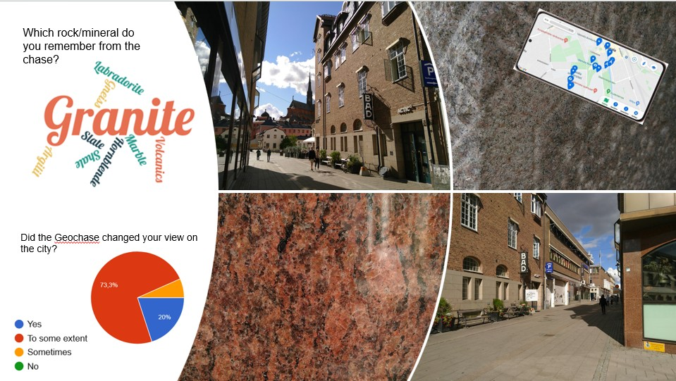

# Geochase

## Why?
### Enhancing Student Learning Outcome
- bridging theoretical class-room practicals and expensive field work
- using the nearby facades and pavements to teach mineral and rock identification

## What about?
### Saving time to prepare a Geochase (Guide, Database, Inspiration)
This Github project summarizes main tasks and thoughts in order to prepare a local chase/scavenger hunt.
Also, it provides ideas and inspiration to design such chase.

## For whom?
### Support for Lecturers in Earth Sciences to design trip for first year Earth Sciences students.
The suggested questions in this project are targeting students, who started studying minerals, rocks and the rock cycle.
Also, questions and locations are suggested for team building exercises and additional fundamental knowledge in Geosciences.

 >“Yes! Det var kul att lära känna nya personer och att vara ute och se bergarter och mineraler på riktigt. Ja! Man lär sig mycket av att se det i verkligheten. Dock skulle vi behöva ett facit, kanske att en lärare går med oss eller liknande.”      a student 
            

>“It is a good introduction to classification of rocks and jumpstarts the way one should think when looking at
a rock. It's a good practical exercise to apply our newly acquired theoretical knowledge.”          a student 

## Content
The following chapters provide insights and support for creating a chase, **step by step**.
Starting from scratch, first questions to designing questions and examples.
Each chapter explains the general purpose and procedure for this step, and shows how it is 
implemented in the examples of the _Geochase in Uppsala_.

General Steps for creating a chase:

- [Purpose](https://github.com/TerraThorben/Geochase/blob/main/subchapters/01_Purpose.md)
- [Preparation](https://github.com/TerraThorben/Geochase/blob/main/subchapters/02_Preparation.md)
- [Before and After Chase](https://github.com/TerraThorben/Geochase/blob/main/subchapters/03_lecture.md)
- [First organisational Questions](https://github.com/TerraThorben/Geochase/blob/main/subchapters/04_AdminQuest.md)
- [Questions Types and Design](https://github.com/TerraThorben/Geochase/blob/main/subchapters/05_questiontypes.md)
- [Start Questions](https://github.com/TerraThorben/Geochase/blob/main/subchapters/06_StartQuest.md)

Specific Ideas and Questions:
- [Overview of Geochase in Uppsala](https://github.com/TerraThorben/Geochase/blob/main/subchapters/07_ExUppsala.md)
- [General Questions about Rocks and Cycle](https://github.com/TerraThorben/Geochase/blob/main/subchapters/08_questionsex.md)
- [Skills in Geology](https://github.com/TerraThorben/Geochase/blob/main/subchapters/09_geoskills.md)
- [local Stations](https://github.com/TerraThorben/Geochase/blob/main/subchapters/10_stations.md)
- [Teambuilding and Fun](https://github.com/TerraThorben/Geochase/blob/main/subchapters/11_teambuilding.md)

## Acknowledgements

I would like to thank _myPeek_ for technical support and advice, Roger Herbert, Karin Högdahl, and Uppsala University, who supported the first version of the Geochase in Uppsala. In addition, I thank my colleagues at TU Delft: Rémi Charton, Tobias Schmiedel and Jan Kees Blom for their insights of organising a chase for students.

