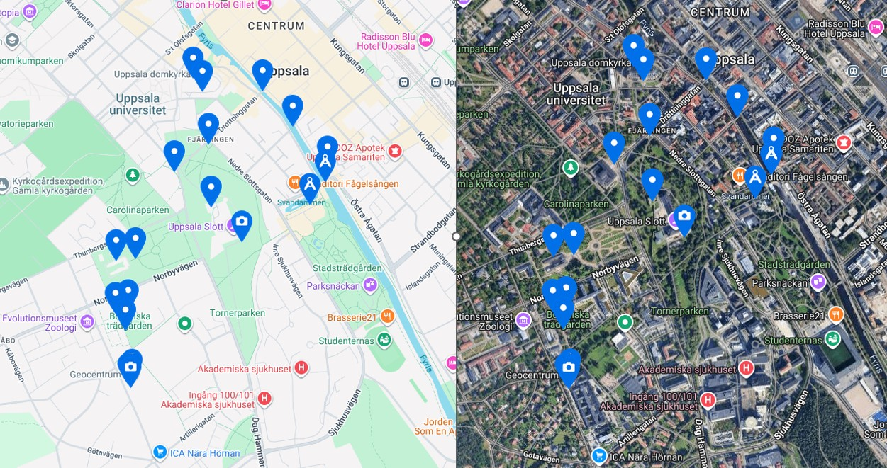

## Examples of locations and questions from Uppsala

## Geochase in Uppsala - Overview

Uppsala has the advantage to host a great variation of facades, buildings, a river, parks and the Geocentrum in a close distance to each other. 

The Geochase in Uppsala **starts** at the Geocentrum of the Uppsala University. The main entrance hosts a skelett of a dinosaurs, a vitrine with a mineral and rock collection, and rock pillars in front of the building. In the first version of the chase, there was also a visit next door at the former building of the Geological Survey of Sweden, since they hosted a small rock garden with a great variety of rocks. However, this building is located in the different direction of the general chase and took additional 30 minutes for the students. Consequently, this location was skipped in the later version of the chase.

After the **first stations** with some basic repetition about rocks and minerals, the administrative questions and introduction, the students were free to choose their path. The following locations are distributed in a cirlce within the city centre of Uppsala and these locations, and these locations are independet from each other. Since there is no ending location or activity afterwards, the students could also choose their pace, allowing taking breaks in a café during the winter version of the chase.

The **facades are choosen** to allow at least asking three questions about the three different rock types (magmatic, metamorphic and sedimentary.) Note, Uppsala is famous for it Uppsala Granite. Consequently, most pavements and facades are made of it.

In addition, the **cathedral of Uppsala** is rich in a variation rocks hosting sedimentary rocks with fossils inside, marble and dolorite pillars, statures out of limestone and granite, and more. Here, one variation of the trip aims to sketch the main entrance of the cathedral and the different rocks should be described by colour, mineral/fossil content etc.

**Also**, I used a copper roof (now in turqouise/green) of a hotel building to ask about oxidation of copper, an iron bridge to ask about iron mining and mining history in Sweden, typical red paint at wooden houses (to protect the wood by using an oxidised iron paint, which is a by-product from mining), the river and fish-stairs to ask about environmental issues, hydrolisis effects on concrete bridges, a viewing point at the castle to ask about orientations, and many more that can be found here.

**Overall**, 80% of the questions were multiple choice or guessing questions, which automatically triggered an **immediate feedback** message to the students. In cases of picutres, open text and the submission of the sketches, some evaluation/grading after the chase has to be done. I aimed to reduce this time to allow running the chase in the afternoon and having all results ready to the students for the morning session next day.