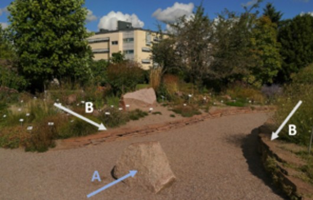

## Detailed Questions of Uppsala Chase (in progress)
### Excerpt from the Geochase in Uppsala - Questions in myPeek

_Hello Adventurers!_
_Welcome to our journey exploring the rocks in the city centre of Uppsala! This field trip guides you to different places and facades across the city centre and trains you in recognizing rocks and learning the rock cycle. Despite the hard rock questions, there is also some fun included. So let´s rock on! Find your first station and answer the question(s)!_

_Hint: the first stations around the Geocentrum provide some basic information about rocks and minerals, which might be helpful for the final stations in the city centre._
 
_Have fun!_
 
*****************************

**Groups**
Multiple people can open the same group, but you can only answer a question once.

**Results**
Your answers are saved immediately. If you are leaving the app, or opening the app on another device, you can continue your field trip by entering the code again. The results of your group can be viewed by your teacher.

**Warning**
Do not be distracted by the app, you're still in real life. Make sure to stay focused and pay attention to the traffic around you.
Enjoy reading the landscape and exploring the area!

*****************************

_Location 1:_
**Welcome to Geocentrum!**

_Intro:_
Take a deep breath and embrace the Geocentrum, where knowledge is created!
When you walk around the foyer, you might have recognized the glass vitrines left of the piano. Please, have a look inside. You see some minerals and rocks as well as some interesting tools, which researchers used years ago to study the Earth.
Please, have a closer look and remember the difference between rocks and minerals.
Simply said: Rocks are composites out of different clasts and minerals, whereas minerals are solid chemical compounds with a crystal structure and specific chemical composition.

_Question 1.1:_
Minerals are solid chemical compounds that have a specific crystal structure and definite chemical composition, whereas rocks are aggregates of minerals that classify the certain rock assemblage.
Which mineral is your favourite in this exhibition?

_Feedback:_
Interesting!

*******

_Text:_
Look at the Uppsala Granite! The Uppsala Granite is very typically for this region around Uppsala, therefore the name. However, the greyish colour as well as the fine grained black inclusions/patches are typical for the Uppsala Granite. Try to remember this. You might see this rock again. :)

*******

_Question 1.2: (multiple-choice)_
Another question: When you stand in the middle of the foyer, above you is the protector of Geocentrum "flying" around examing each intruder to Geocentrum. When was this mesosaurus alive back in time?

A. Cretaceous 
B. **Perm** (correct)
C. Carboniferous
D. Jurassic

_Feedback:_
_Correct:_
Yes! Pretty old, isn´t it? This mesosaurus lived mostly in marine environment and before the ancient creatures started living on land.

_Wrong:_
No! Perm is the correct answer. Very old, isn´t it? This mesosaurus lived mostly in marine environment and before the ancient creatures started living on land.

*******

_Question 1.3: (open text)_
Please, give our new friend and protector of Geocentrum a nickname. It would a shame, if this old mesosaurus has no name. What do you suggest?

_Feedback:_
Funny name! Cool!

*******

_Location 2: (In front of Geocentrum)_
_Intro:_
In front of Geocentrum next to the bike stands, there are three blocks of rocks next to the wall. All three rocks are classified as the same rock type, but weathering or human interaction changed their look. Have a look and admire the concentric ellipsoids within the rock.

_Question 2.1: (multiple-choice)_
There are three rock pillars next the the wall of Geocentrum. What is the name of the presented rock?

A. Augengneiss
B. **Orbicular Granite/Klotgranit** (correct)
C. Lava
D. Sandstone

_Feedback:_
_Correct:_
Correct! This rock is a plutonic/intrusive rock. It is called orbicular granite or in Swedish: Klotgranit. It is not a common structure for this type of rock, but there are some localities around the world where you can find these orbicular shapes in the granite. The formation of the orbiculars are still highly debated, but scientist believe, that is has something to do with fast cooling and a rapid pressure drop at margin of magma chambers.

_Wrong:_
Nope! This rock is a plutonic/intrusive rock. It is called orbicular granite or in Swedish: Klotgranit. It is not a common structure for this type of rock, but there are some localities around the world where you can find these orbicular shapes in the granite. The formation of the orbiculars are still highly debated, but scientist believe, that is has something to do with fast cooling and a rapid pressure drop at margin of magma chambers.

*******

_Location 3: Orange Rocks - Are they the same?_
_Intro:_
Here, you find two kinds of red-orange rocks (A and B). One type is lying in the middle of the path (A - blue arrow) and the other type encloses the garden as stacked plates (B - white arrows). What are the differences between these rocks? Describe the two types! Think about it before you answer the next questions.
 

_Question 3.1: (multiple-choice)_
There are two different types of orange rocks next to you. One is a magmatic rock, the other a sedimentary rock. Magmatic rocks are divided into two subgroups. One is a coarse-grained intrusive rock, also known as plutonic rock. The other subgroup is called extrusive rock. Extrusive rocks (like Lava) are rocks, that are very fine-grained. When hot magma erupts  to the surface of the Earth (e.g., Lava), it crystalizes very fast (fast cool down). Consequently, the minerals/crystals are very fine grained as they have not much time to form. They are almost not visible with naked eye. However, magmatic rocks are in general very hard (with some exceptions), compared to sedimentary rocks. Sedimentary rocks are rocks that are made out of sediments (e.g., sand, clay) and fossils. 

Now, what type of rock is the orange one in the middle of the path way (A)? (Do you see single minerals/crystals? What size have the minerals? Or can you identify fossils?)

...

